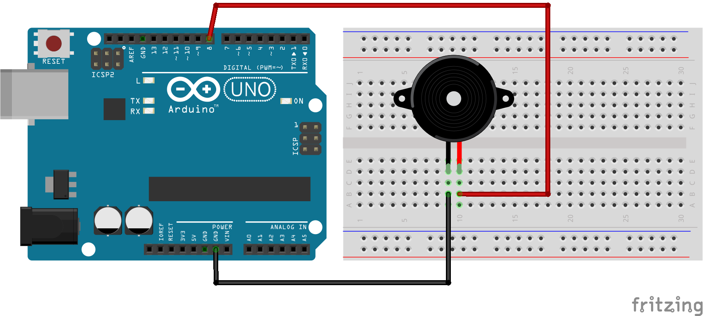
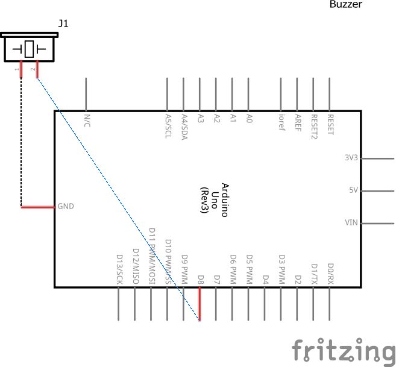

# Código para testar um Buzzer Ativo

### Neste projeto um Buzzer Ativo é conectado na porta 8 do Arduino fazendo o emitir um som quando a porta digital for alta (5v).

### Componentes necessários
* 1x Placa Arduino
* 1x Breadboard
* 1x Buzzer Ativo
* Jumpers

### Circuito

### Schematics
