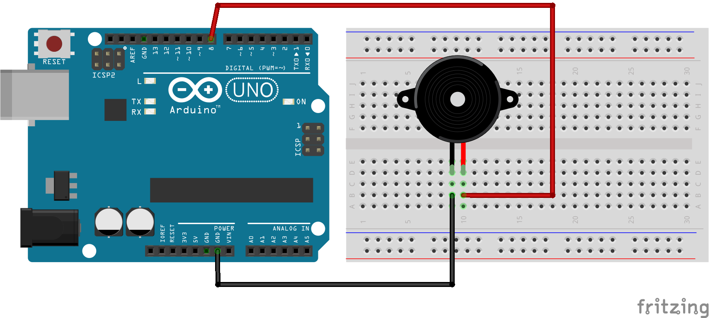
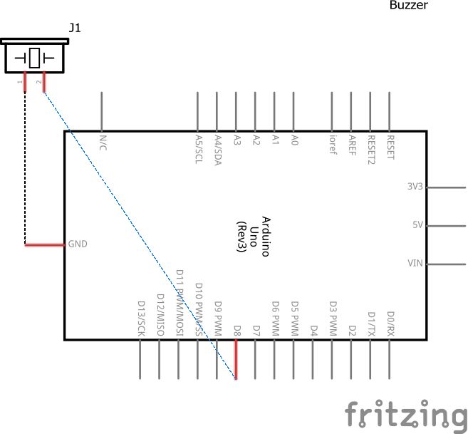

# Código para testar um Buzzer Passivo

### Neste projeto um Buzzer Passivo é conectado na porta 8 do Arduino fazendo o emitir um som quando um tom for emitido.

### Componentes necessários
* 1x Placa Arduino
* 1x Breadboard
* 1x Buzzer Passivo
* Jumpers

### Circuito

### Schematics
