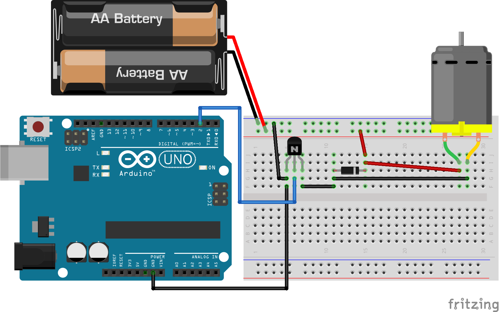
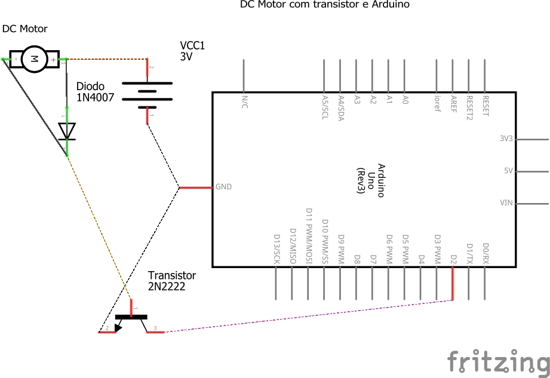

# Código do curso Magos do Arduino para utilizar um transistor para controlar um motor dc com o Arduino

### Neste projeto um transistor 2N2222 é utilizado em conjunto com o Arduino para controlar motor dc de ~5v.

### Artigo do projeto
[https://magosdoarduino.web.app/transistor-2n2222-motor-dc-arduino.html](https://magosdoarduino.web.app/transistor-2n2222-motor-dc-arduino.html)

### Componentes necessários
* 1x Placa Arduino
* 1x Breadboard
* 1x Transistor 2N2222 ou similar
* 1x Motor DC de ~5v
* 1x Diodo 1N4007
* 1x Alimentação entre 3-5v, como duas pilhas AA
* Jumpers

### Circuito

### Schematics

