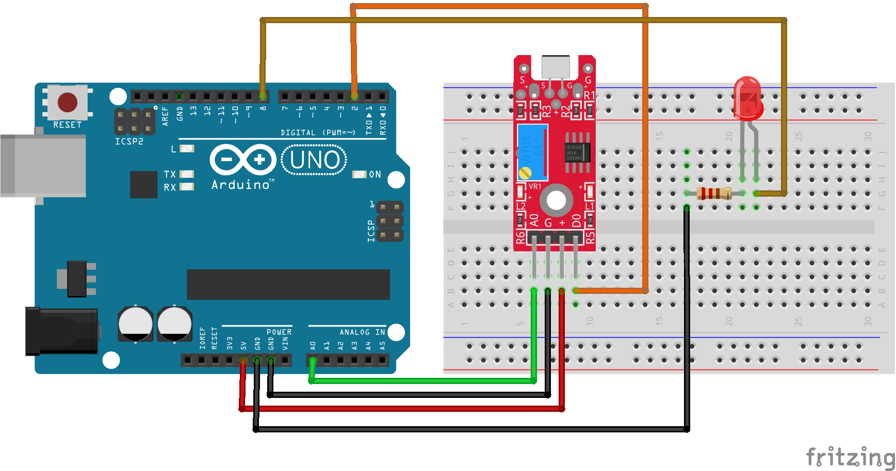
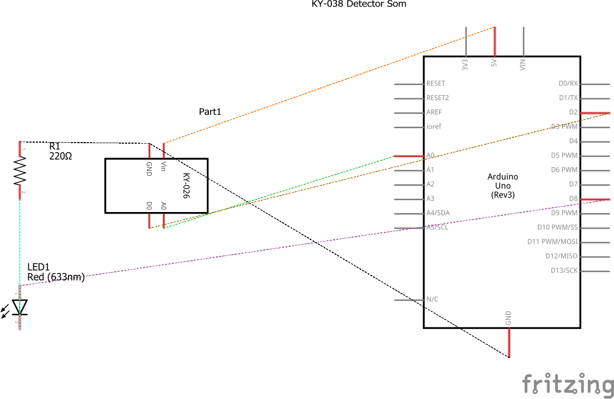

# Código para conectar um módulo detector de som (KY-038) no Arduino

### Neste projeto um módulo detector de som (KY-038) será conectado ao Arduino e a leitura de seus valores serão impressas no monitor serial, além de controlar um LED quando um som é detectado.

### Artigo do projeto
[https://magosdoarduino.web.app/detector-som-ky038-arduino.html](https://magosdoarduino.web.app/detector-som-ky038-arduino.html)

### Componentes necessários
* 1x Placa Arduino
* 1x Breadboard
* 1x Módulo detector de som KY-038
* 1x LED
* 1x Resistor de 220-330 Ohms
* Jumpers

### Circuito

### Schematics
