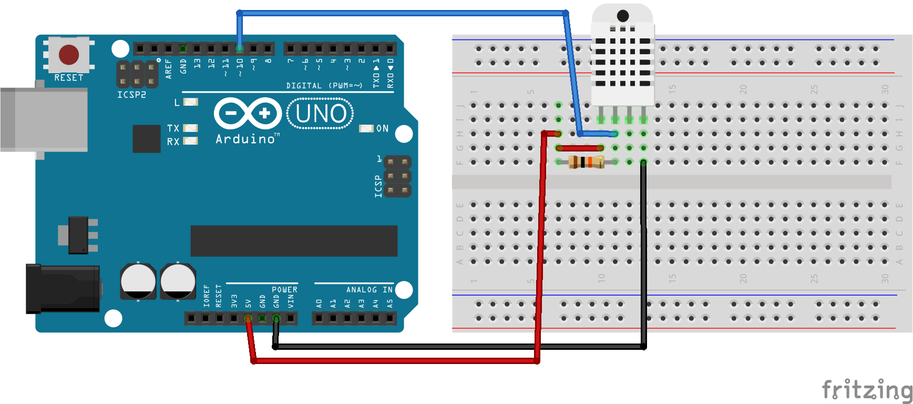
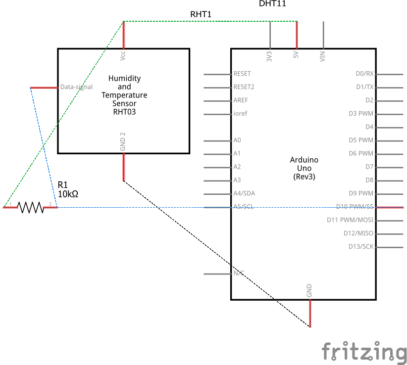

# Código para conectar um sensor de temperatura e umidade DHT11 no Arduino

### Neste projeto um sensor de temperatura e umidade DHT11 será conectado ao Arduino e a leitura de seus valores serão impressos no monitor serial.

### Artigo do projeto
[https://magosdoarduino.web.app/dht11-temperatura-umidade-arduino.html](https://magosdoarduino.web.app/dht11-temperatura-umidade-arduino.html)

### Biblioteca utilizada para controlar o sensor DHT11
[https://github.com/DFRobot/DFRobot_DHT11](https://github.com/DFRobot/DFRobot_DHT11)

### Componentes necessários
* 1x Placa Arduino
* 1x Breadboard
* 1x DHT11
* 1x Resistor de 10k Ohms
* Jumpers

### Circuito

### Schematics
