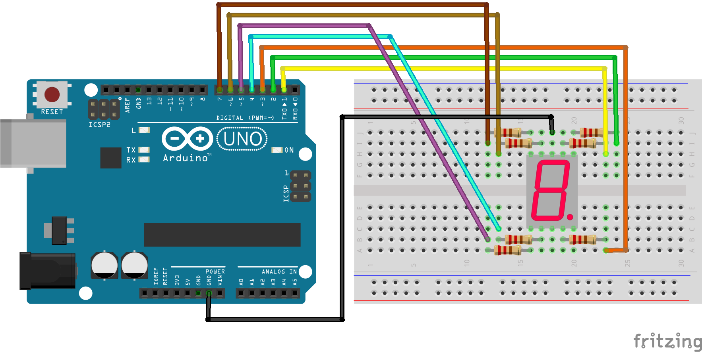
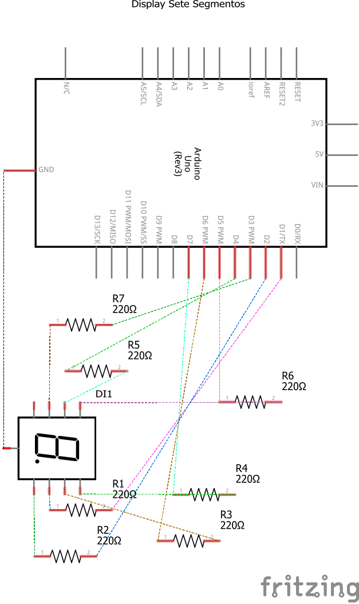

# Código para conectar um display de sete segmentos no Arduino

### Neste projeto um display de sete segmentos será conectado ao Arduino e os números de 0 a 9 serão exibidos sequencialmente em um intervalo de 1 segundo entre os números.

### Artigo do projeto
[https://magosdoarduino.web.app/display-sete-segmentos-arduino.html](https://magosdoarduino.web.app/display-sete-segmentos-arduino.html)

### Componentes necessários
* 1x Placa Arduino
* 1x Breadboard
* 1x Display de Sete Segmentos
* 7x Resistores de 220-330 Ohms
* Jumpers

### Circuito

### Schematics
