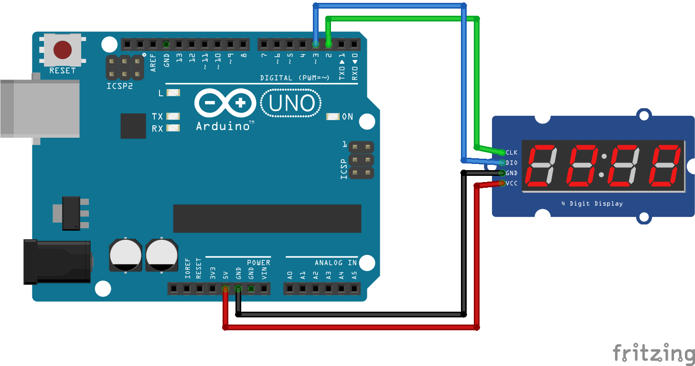
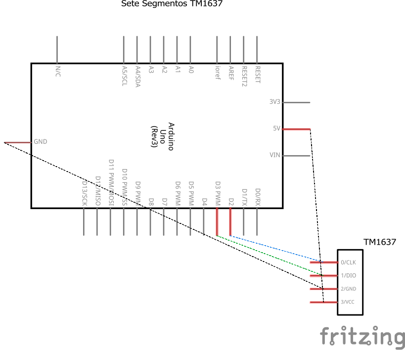

# Código para conectar um display de sete segmentos de 4 dígitos controlado pelo TM1637 no Arduino

### Neste projeto um display de sete segmentos de 4 dígitos controlado pelo TM1637 será conectado ao Arduino que exibe a hora e minutos.

### Artigo do projeto
[https://magosdoarduino.web.app/display-sete-segmentos_tm1637-arduino.html](https://magosdoarduino.web.app/display-sete-segmentos-tm1637-arduino.html)

### Componentes necessários
* 1x Placa Arduino
* 1x Display de Sete Segmentos TM1637 de 4 dígitos
* Jumpers

### Circuito

### Schematics
