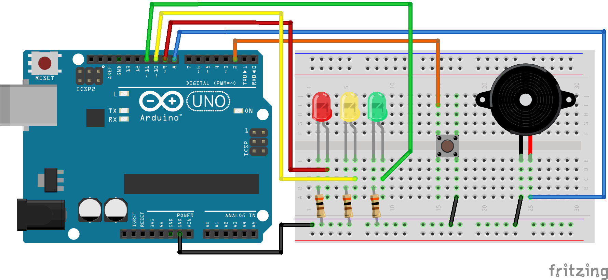
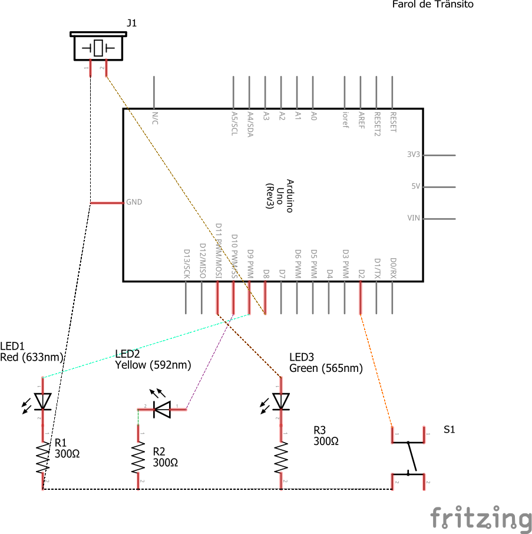

# Código para criar um farol de trânsito com o Arduino

### Neste projeto criaremos um farol de trânsito com o Arduino.

### Artigo do projeto
[https://magosdoarduino.web.app/farol-transito-arduino.html](https://magosdoarduino.web.app/farol-transito-arduino.html)

O farol contém além das luzes um botão que ao ser pressionado muda do vermelho para verde.

Também foi adicionado um buzzer ativo para emitir um som sempre o sinal estiver verde, para auxiliar deficientes visuais.

### Componentes necessários
* 1x Placa Arduino
* 1x Breadboard
* 1x Buzzer Ativo
* 1x Push Button
* 3x LED (vermelho, verde e amarelo)
* 3x resistores de 220-300 Ohm
* Jumpers

### Circuito

### Schematics
