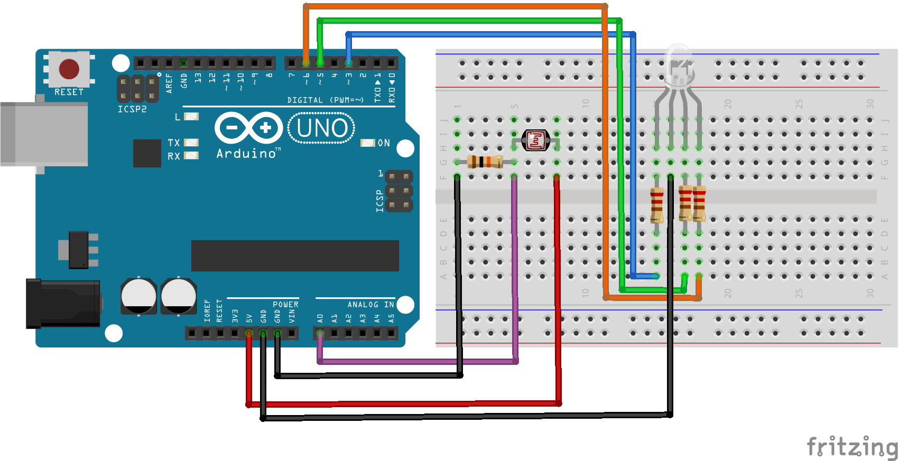

# Código para conectar um Fotoresistor no Arduino e gerar transição de cores em um LED RGB

### Neste projeto um fotoresistor será conectado ao Arduino e sempre que o valor for baixo, ou seja, estiver escuro, o LED RGB será acionado.

### Artigo do projeto
[https://magosdoarduino.web.app/fotoresistor-led_rgb-arduino.html](https://magosdoarduino.web.app/fotoresistor-led_rgb-arduino.html)

### Componentes necessários
* 1x Placa Arduino
* 1x Breadboard
* 1x Fotoresistor
* 1x Resistor de 10k Ohms
* 1x LED RGB
* 3x Resistores de 220-330 Ohms
* Jumpers

### Circuito

### Schematics
