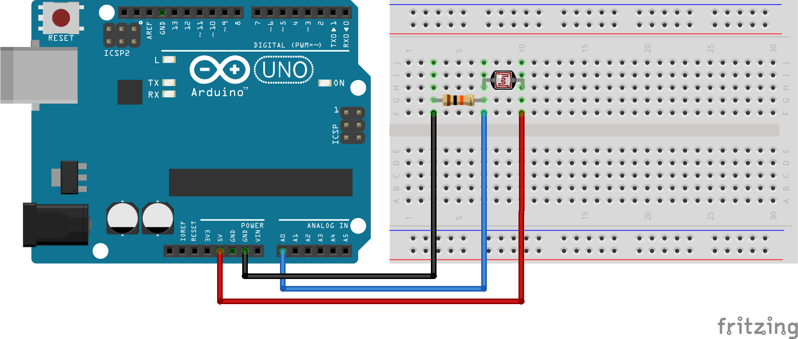
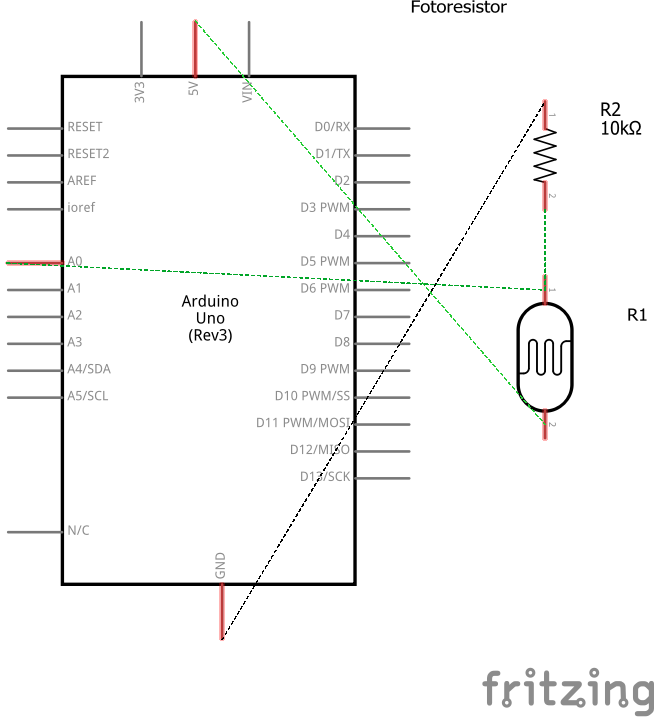

# Código para conectar um Fotoresistor no Arduino

### Neste projeto um fotoresistor será conectado ao Arduino e a leitura de seus valores serão impressas no monitor serial.

### Artigo do projeto
[https://magosdoarduino.web.app/fotoresistor-arduino.html](https://magosdoarduino.web.app/fotoresistor-arduino.html)

### Componentes necessários
* 1x Placa Arduino
* 1x Breadboard
* 1x Fotoresistor
* 1x Resistor de 10k Ohms
* Jumpers

### Circuito

### Schematics
