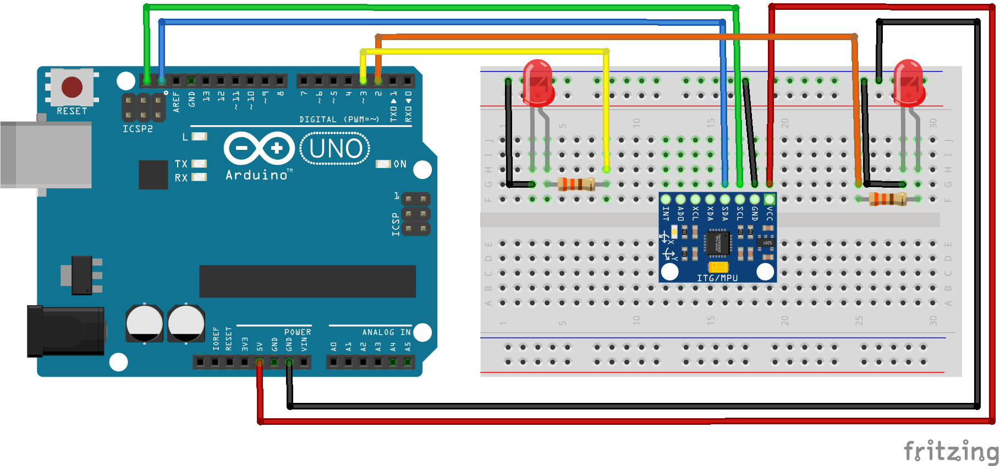

# Código do curso Magos do Arduino para utilizar o acelerômetro e giroscópio GY521 com o Arduino

### Este código imprime no monitor serial os valores lidos do acelerômetro e giroscópio. Ele também controla dois LEDs que indicam a inclinação do eixo Y do acelerômetro.

Este código depende da biblioteca GY521, que pode ser instalada via gerenciador de bibliotecas da IDE do Arduino.

### Artigo do projeto
[https://magosdoarduino.web.app/acelerometro-gy521-arduino.html](https://magosdoarduino.web.app/acelerometro-gy521-arduino.html)

### Componentes necessários
* 1x Breadboard
* 1x Placa Arduino UNO
* 1x Módulo acelerômetro GY521
* 2x LEDs de qualquer cor
* 2x Resistores de 220-330Ohms
* Jumpers

### Circuito
