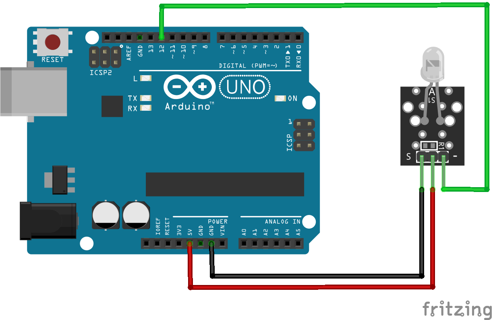
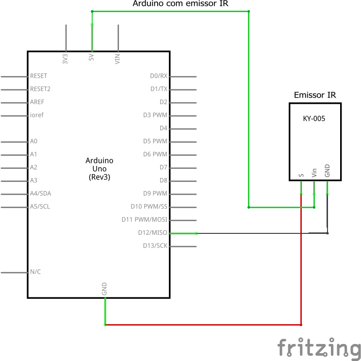

# Código do curso Magos do Arduino para utilizar um emissor/transmissor infravermelho (IR) com o Arduino

### Utilize um emissor IR com o Arduino para enviar comandos para outro dispositivo. Este exemplo usa como referência o projeto ir_receptor.ino.

### Artigo do projeto
[https://magosdoarduino.web.app/emissor-ir-arduino.html](https://magosdoarduino.web.app/emissor-ir-arduino.html)

Este projeto faz uso da biblioteca IRremote, testada na versão 4.4.3, que deve ser instalada diretamente pelo gerenciador de bibliotecas no Arduino IDE.

### Componentes necessários
* 1x Breadboard (opcional)
* 1x Placa Arduino
* 1x Módulo emissor infravermelho (IR)
* Jumpers

### Circuito

### Schematics

