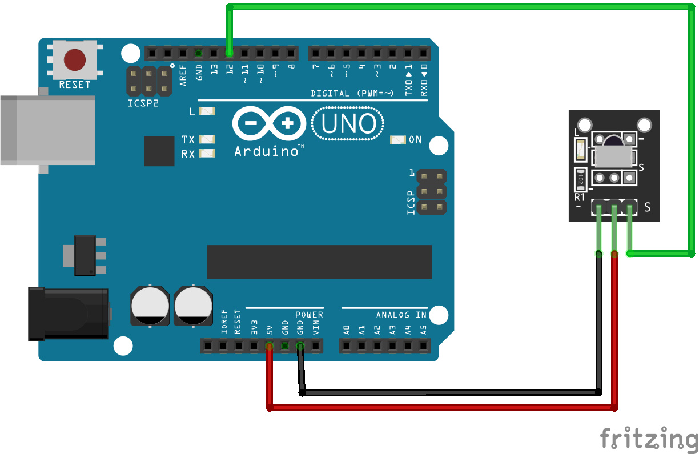

# Código do curso Magos do Arduino para utilizar um receptor infravermelho (IR) com o Arduino

### Utilize um receptor IR com o Arduino para receber comandos de um controle remoto, imprimindo os valores recebidos no monitor serial e acendendo ou apagando o LED do Arduino.

### Artigo do projeto
[https://magosdoarduino.web.app/receptor-ir-arduino.html](https://magosdoarduino.web.app/receptor-ir-arduino.html)

Este projeto faz uso da biblioteca IRremote, testada na versão 4.4.3, que deve ser instalada diretamente pelo gerenciador de bibliotecas no Arduino IDE.

### Componentes necessários
* 1x Breadboard (opcional)
* 1x Placa Arduino
* 1x Módulo receptor infravermelho (IR)
* Jumpers

### Circuito

### Schematics

