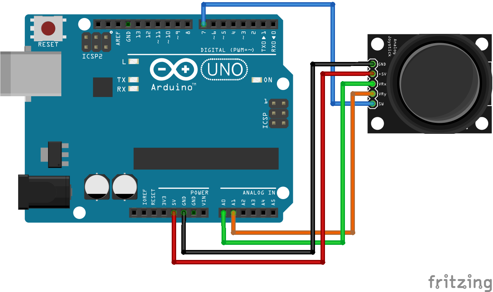
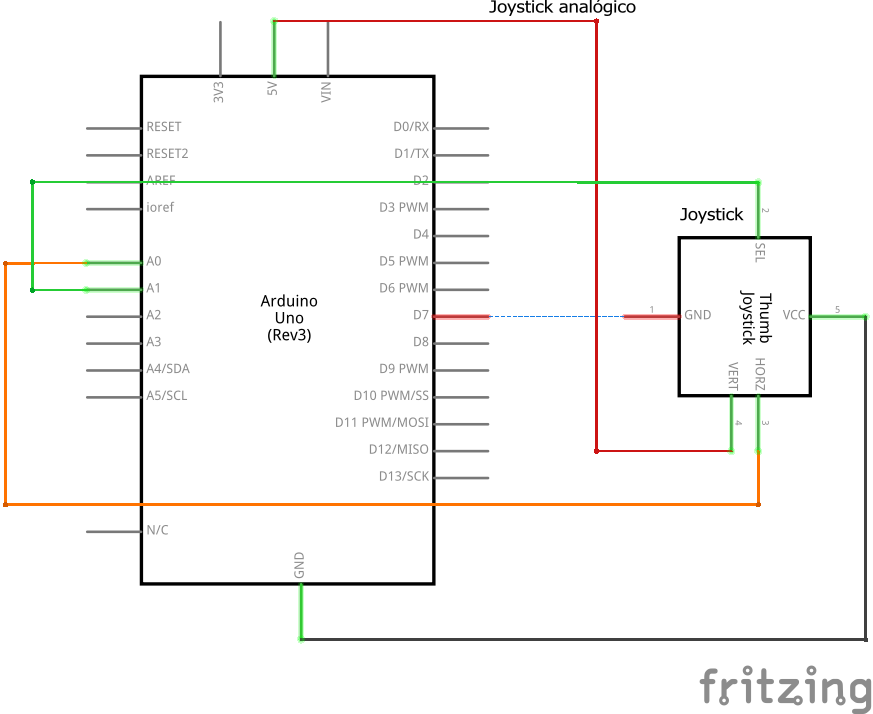

# Código para conectar um joystick analógico no Arduino

### Conecte um joystick analógico no Arduino e imprima os valores no monitor serial.

### Artigo do projeto
[https://magosdoarduino.web.app/joystick-analogico-arduino.html](https://magosdoarduino.web.app/joystick-analogico-arduino.html)

### Componentes necessários
* 1x Breadboard (opcional)
* 1x Placa Arduino
* 1x Joystick analógico KY-023
* Jumpers

### Circuito

### Schematics

