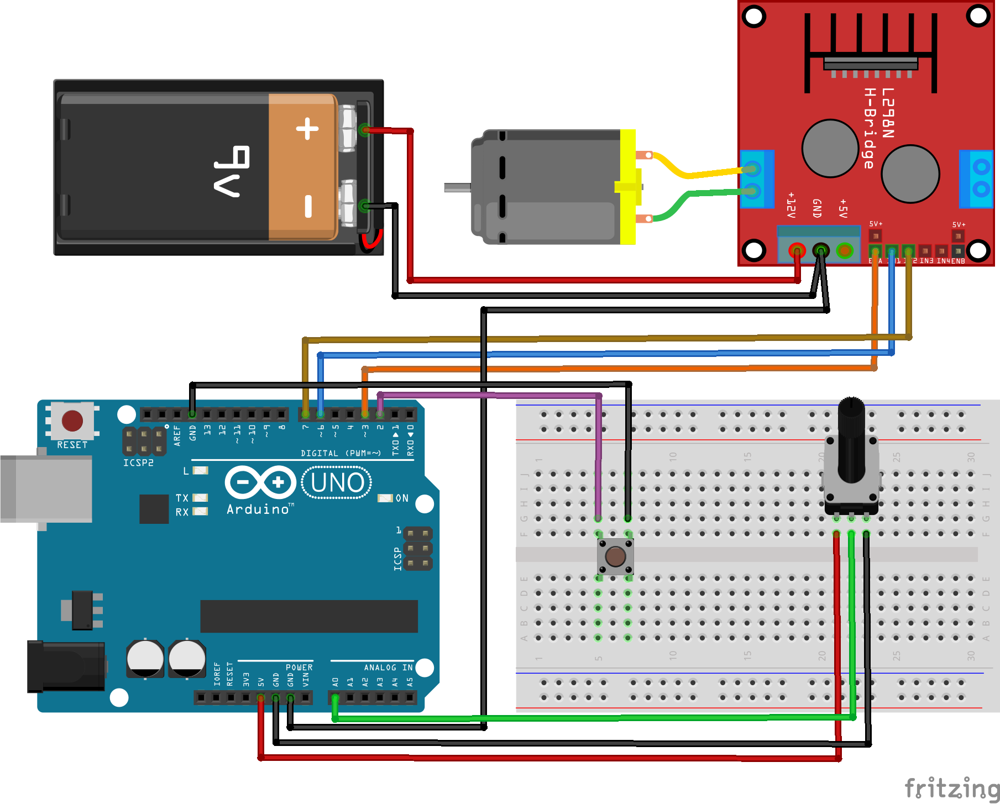

# Código para controlar um motor dc com o módulo L298N no Arduino

###  Controle de um motor dc de ~5v utilizando o módulo L298N. Permite controle de velocidade com um potenciômetro e rotacionar o motor em ambas as direções ao pressionar um push button.

### Artigo do projeto
[https://magosdoarduino.web.app/l298n-motor-dc-arduino.html](https://magosdoarduino.web.app/l298n-motor-dc-arduino.html)

### Componentes necessários
* 1x Placa Arduino
* 1x Breadboard
* 1x Potenciômetro de 10k
* 1x Push button
* 1x Motor DC de ~5v
* 1x Módulo L298N
* 1x Fonte de alimentação de 5v-12v
* Jumpers

### Circuito

