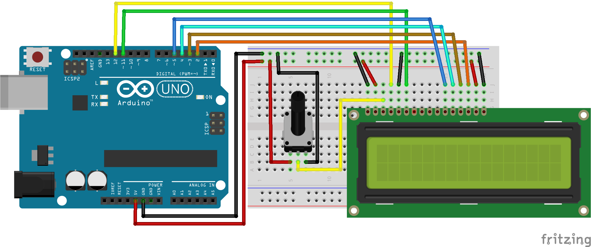

# Código para conectar um display LCD de 16x2 no Arduino

### Neste projeto um display de LCD de 16x2 será conectado ao Arduino e uma demonstração de suas funcionalidades será exibida no display.

A biblioteca **LiquidCrystal.h** deve ser instalada no Arduino IDE para que o código funcione. Ela é instalada automaticamente caso você tenha instalado o suporte para placas Arduino Uno R4.

### Artigo do projeto
[https://magosdoarduino.web.app/display-lcd-16x2-arduino.html](https://magosdoarduino.web.app/display-lcd-16x2-arduino.html)

### Componentes necessários
* 1x Placa Arduino
* 1x Breadboard
* 1x Display LCD de 16x2
* 1x Potenciômetro de 10k
* Jumpers

### Circuito

