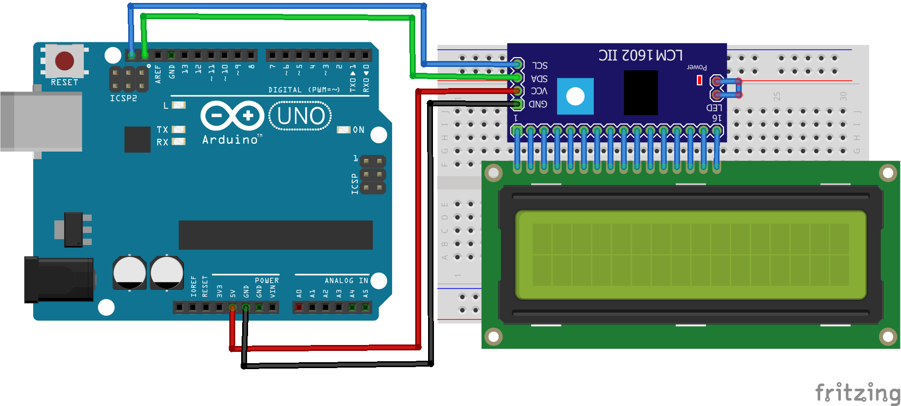
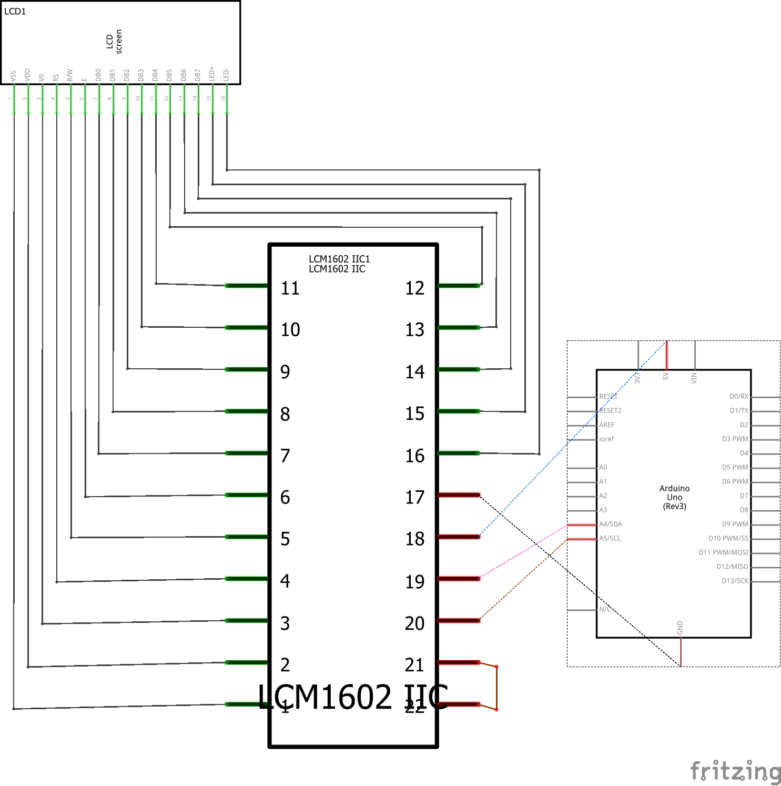

# Código para conectar um display LCD de 16x2 no Arduino através do módulo de comunicação I2C PCF8574T

### Neste projeto um display de LCD de 16x2 será conectado ao Arduino através do módulo de comunicação I2C PCF8574T, e uma demonstração de suas funcionalidades será exibida no display.

A biblioteca **LiquidCrystal_I2C.h** deve ser instalada no Arduino IDE para que o código funcione. Ela pode ser instalada diretamente pelo gerenciador de bibliotecas do Arduino IDE.

### Artigo do projeto
[https://magosdoarduino.web.app/display-lcd-16x2-i2c-pcf8574t-arduino.html](https://magosdoarduino.web.app/display-lcd-16x2-i2c-pcf8574t-arduino.html)

### Componentes necessários
* 1x Placa Arduino
* 1x Breadboard
* 1x Display LCD de 16x2
* 1x Módulo I2C PCF8574T
* Jumpers

### Circuito

### Schematics

