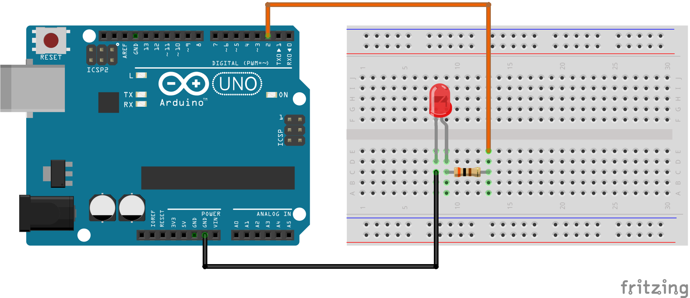
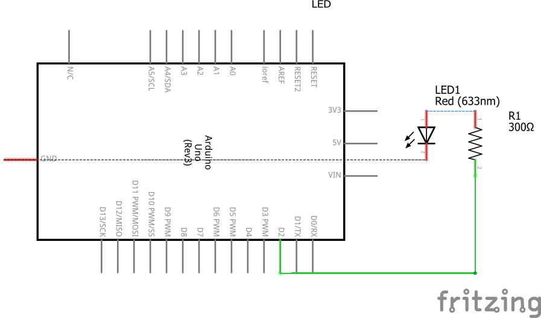

# Código para piscar um LED

### Neste projeto um LED é conectado na porta 2 do Arduino, e o LED pisca a cada meio segundo.

### Componentes necessários
* 1x Placa Arduino Uno
* 1x Breadboard
* 1x LED da cor de sua preferência
* 1x Resistor de 220 a 300 Ohms 
* Fios para a conexão do circuito

### Circuito

### Schematics
