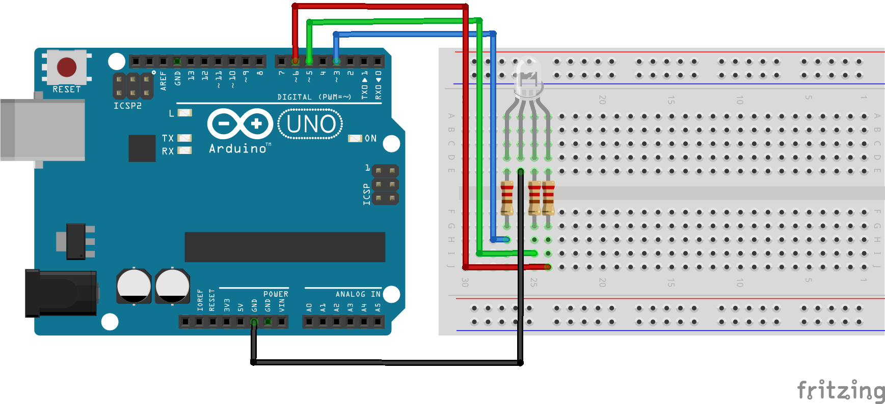
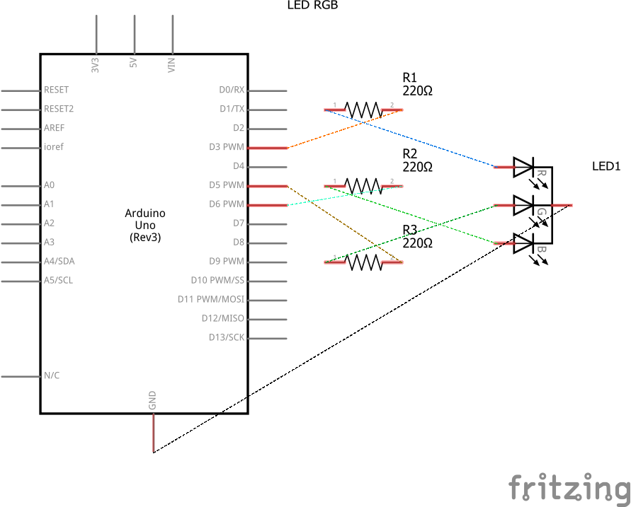

# Código para conectar um LED RGB no Arduino e realizar transição de cores

### Neste projeto um LED RGB será conectado ao Arduino e as cores serão alteradas em uma transição entre as cores vermelha, verde e azul.

### Artigo do projeto
[https://magosdoarduino.web.app/led-rgb-arduino.html](https://magosdoarduino.web.app/led-rgb-arduino.html)

### Componentes necessários
* 1x Placa Arduino
* 1x Breadboard
* 1x LED RGB
* 3x Resistores de 220-330 Ohms
* Jumpers

### Circuito

### Schematics
