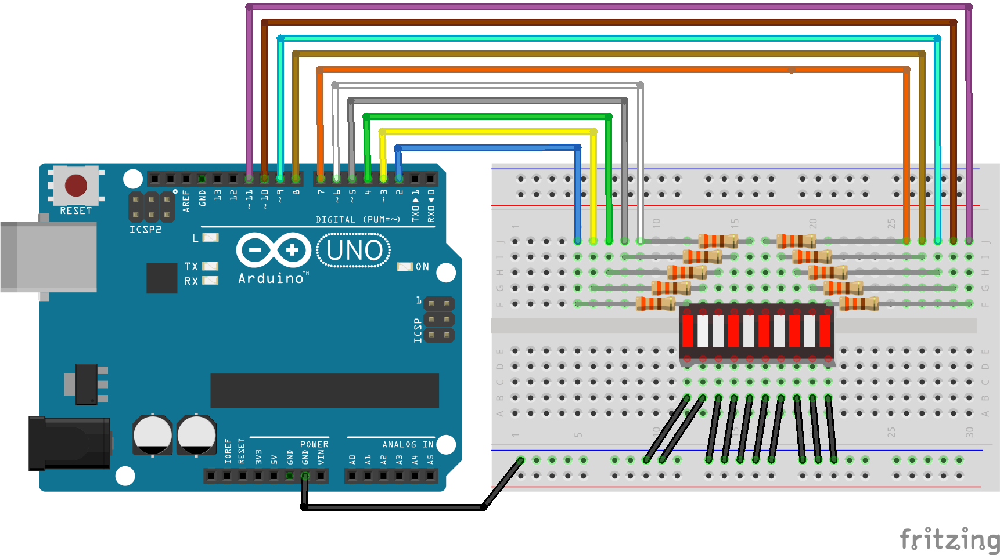

# Código para conectar uma barra de LEDs de 10 segmentos no Arduino

### Neste projeto uma barra de LEDs de 10 segmentos será conectada ao Arduino e os LEDs acenderão em ordem a cada meio segundo.

### Artigo do projeto
[https://magosdoarduino.web.app/ledbar-10-segmentos-arduino.html](https://magosdoarduino.web.app/ledbar-10-segmentos-arduino.html)

### Componentes necessários
* 1x Placa Arduino
* 1x Breadboard
* 1x Barra de LEDs de 10 segmentos
* 10x Resistores de 220-330 Ohms
* Jumpers

### Circuito

