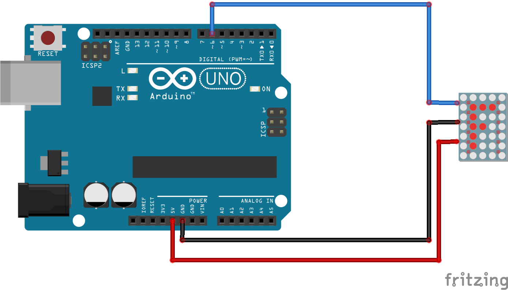

# Código para conectar uma matriz de LEDs RGB (NeoPixels) no Arduino

### Neste projeto uma matriz de LEDs RGB (NeoPixels) será conectada ao Arduino e uma pixel art será exibida nela.

### Artigo do projeto
[https://magosdoarduino.web.app/neopixel-matriz-arduino.html](https://magosdoarduino.web.app/neopixel-matriz-arduino.html)

### Biblioteca utilizada para controlar a matriz de LEDs RGB (NeoPixel)
[https://github.com/adafruit/Adafruit_NeoPixel](https://github.com/adafruit/Adafruit_NeoPixel)

### Componentes necessários
* 1x Placa Arduino
* 1x Matriz de NeoPixels de 16x16
* Jumpers

### Circuito

