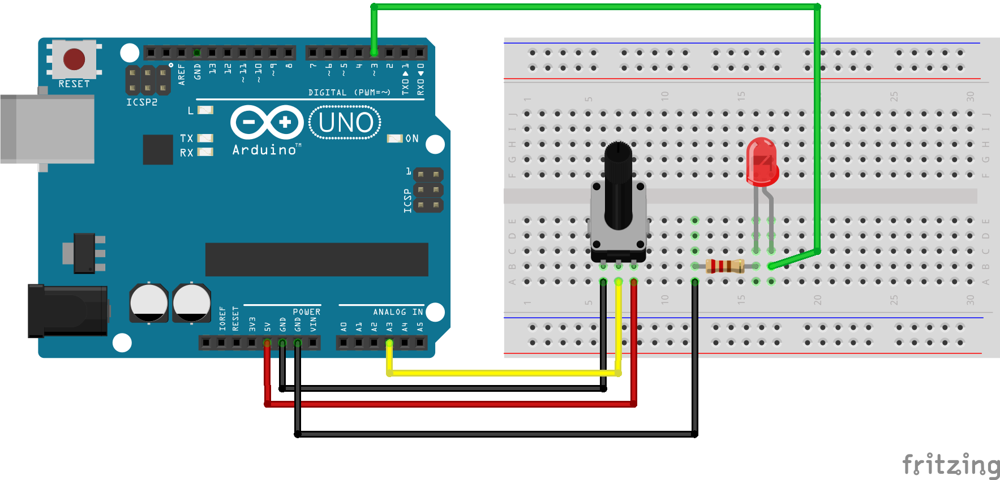
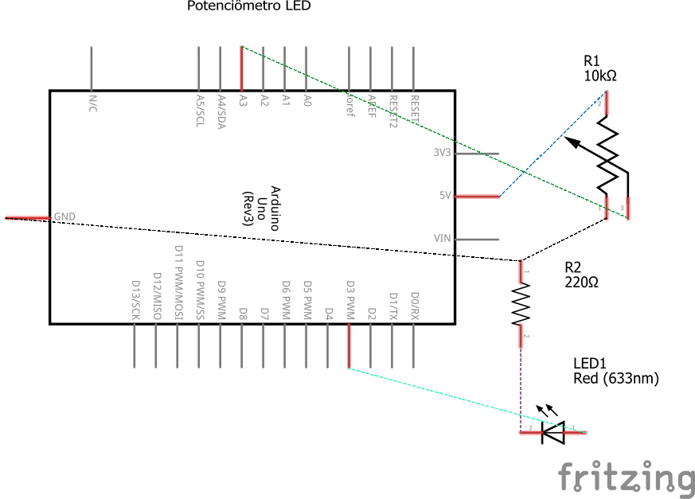

# Código para usar um potenciômetro para controlar a intensidade de luz de um LED

### Neste projeto um potenciômetro será conectado ao Arduino para controlar a luminosidade de um LED.

### Artigo do projeto
[https://magosdoarduino.web.app/potenciometro-arduino.html](https://magosdoarduino.web.app/potenciometro-arduino.html)

### Componentes necessários
* 1x Placa Arduino
* 1x Breadboard
* 1x Potenciômetro de 10k
* 1x LED
* 1x Resistor 220-330 Ohms
* Jumpers

### Circuito

### Schematics
