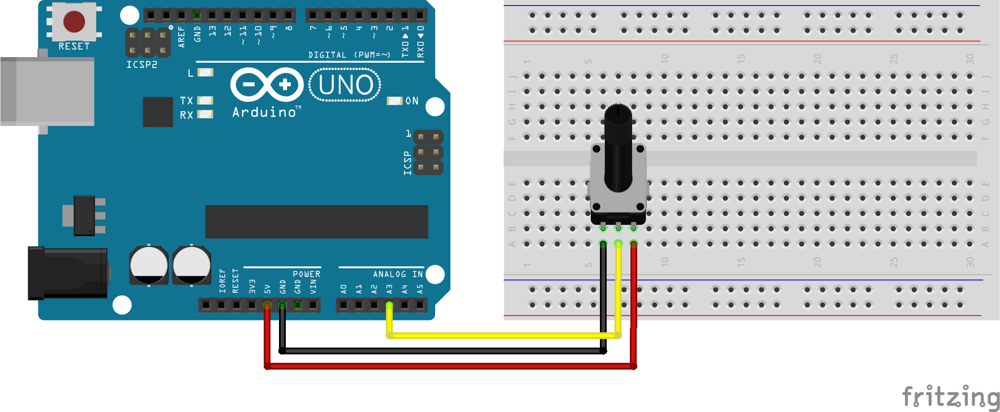
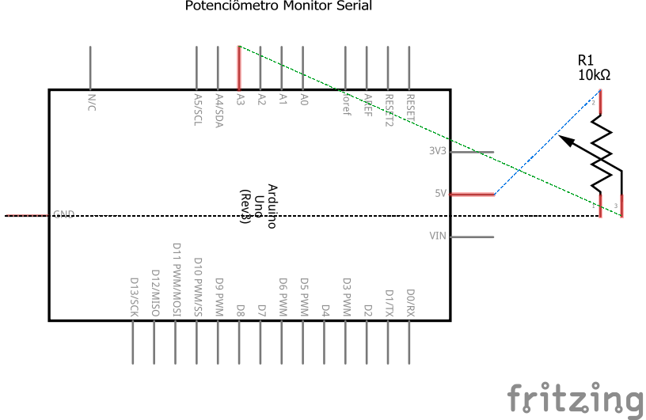

# Código para testar um potenciômetro com o Arduino

### Neste projeto um potenciômetro será conectado ao Arduino e a leitura de seus valores será impressa no monitor serial do Arduino.

### Artigo do projeto
[https://magosdoarduino.web.app/potenciometro-arduino.html](https://magosdoarduino.web.app/potenciometro-arduino.html)

### Componentes necessários
* 1x Placa Arduino
* 1x Breadboard
* 1x Potenciômetro de 10k
* Jumpers

### Circuito

### Schematics
