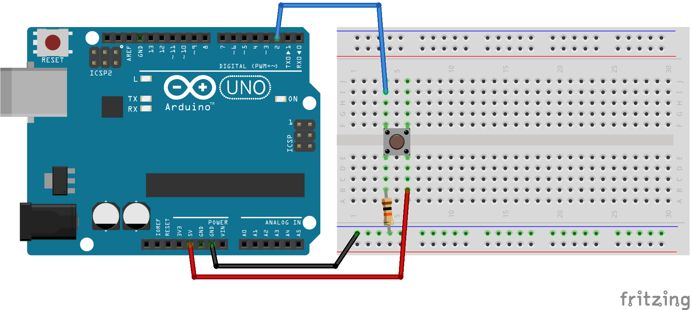
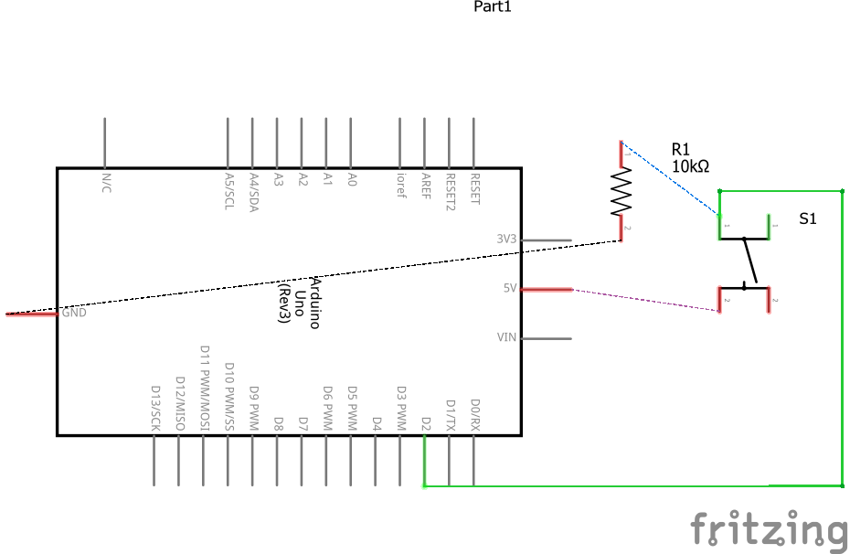

# Código para testar um push button usando Pull Down

### Neste projeto um push button é conectado na porta 2 do Arduino fazendo o uso de um resistor de 10k para realizar o Pull Down, o que o torna normalmente alto (5V). 

### Ao pressionar o push button, o LED presente na placa Arduino acende.

### Artigo do projeto
[https://magosdoarduino.web.app/push-buttons-arduino.html](https://magosdoarduino.web.app/push-buttons-arduino.html)

### Componentes necessários
* 1x Placa Arduino
* 1x Breadboard
* 1x Push Button
* 1x Resistor de 10k
* Jumpers

### Circuito

### Schematics
