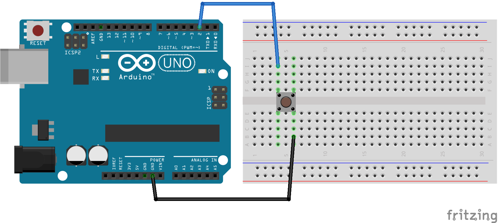
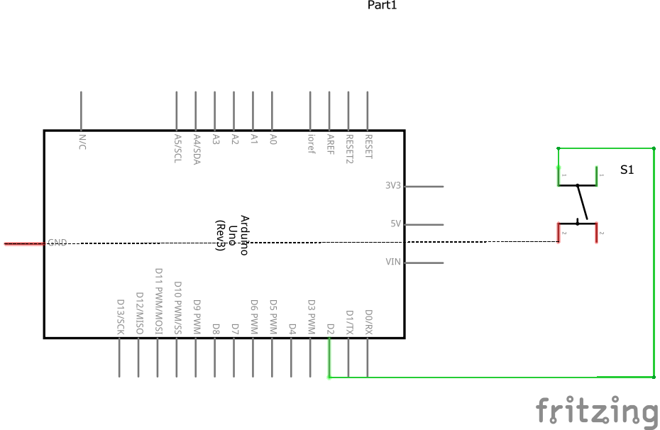

# Código para testar um push button usando Pull Up

### Neste projeto um push button é conectado na porta 2 do Arduino fazendo o uso do modo Pull Up do Arduino, o que o torna normalmente baixo (0V/GND). 

### Ao pressionar o push button, o LED presente na placa Arduino acende.

### Componentes necessários
* 1x Placa Arduino
* 1x Breadboard
* 1x Push Button
* Jumpers

### Circuito

### Schematics
