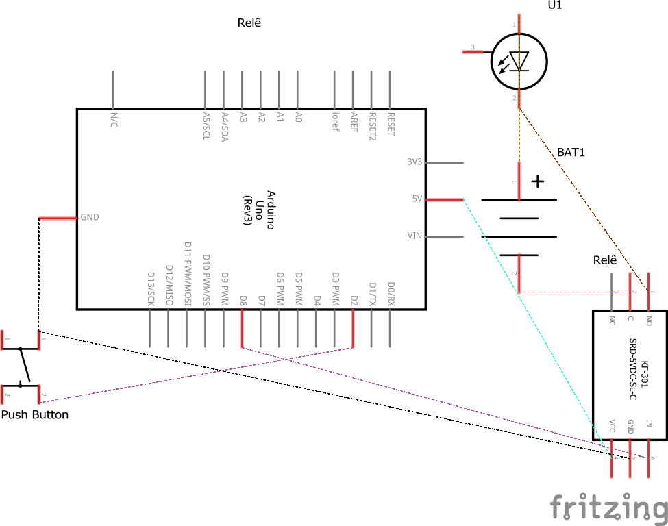

# Código para controlar um relé com o Arduino

###  Utilize um relé com o Arduino para ligar e desligar uma lâmpada conectada a uma fonte externa.

### Artigo do projeto
[https://magosdoarduino.web.app/rele-arduino.html](https://magosdoarduino.web.app/rele-arduino.html)

### Componentes necessários
* 1x Breadboard
* 1x Placa Arduino
* 1x Módulo Relé
* 1x Push button
* 1x Lâmpada de 9V-12V
* 1x Bateria de 9V
* Jumpers

### Circuito

### Schematics

