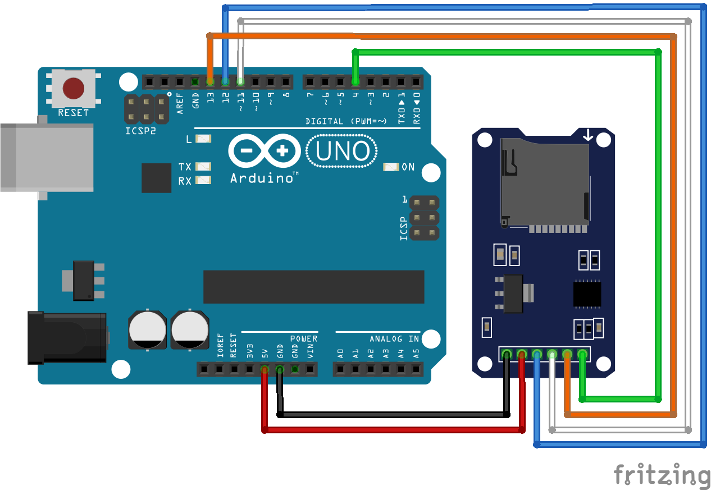

# Código do curso Magos do Arduino para utilizar módulo de cartão SD com o Arduino

### Código que imprime no monitor serial as principais informações sobre o cartão SD, como tipo, tamanho da partição e lista de arquivos presentes no cartão.

Depende da biblioteca SD, que já vem instalada por padrão na IDE do Arduino.
 
Cartão SD deve estar formatado em FAT16 ou FAT32 para funcionar corretamente.

Pinos do módulo de cartão SD conectado ao Arduino UNO via SPI:
- SDO/MOSI - pino 11
- SDI/MISO - pino 12
- CLK/SCK  - pino 13
- CS       - pino  4

### Artigo do projeto
[https://magosdoarduino.web.app/sd-card-info-arduino.html](https://magosdoarduino.web.app/sd-card-info-arduino.html)

### Componentes necessários
* 1x Breadboard (opcional)
* 1x Placa Arduino UNO
* 1x Módulo leitor de cartão SD
* Jumpers

### Circuito
