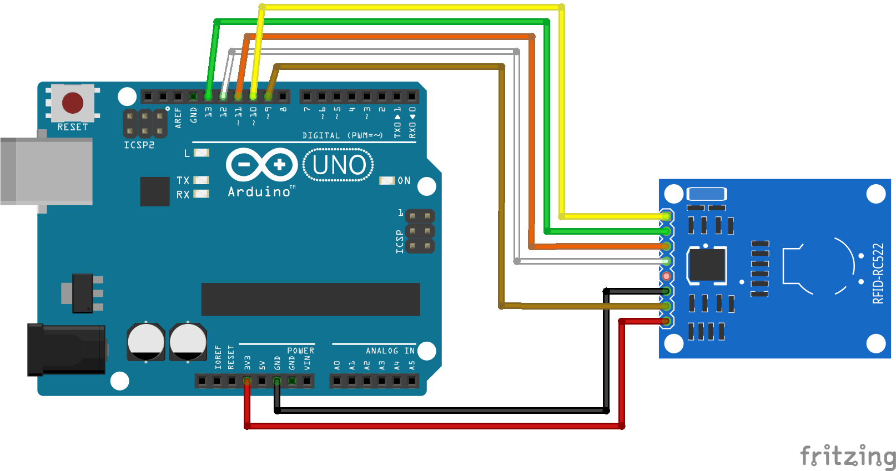

# Código do curso Magos do Arduino para utilizar um sensor de leitura RFID de cartões com o Arduino

### Código de demonstração que grava e lê dados de um cartão RFID, imprimindo no monitor serial detalhes do processo com o Arduino.

### Artigo do projeto
[https://magosdoarduino.web.app/sensor-rfid-rc522-arduino.html](https://magosdoarduino.web.app/sensor-rfid-rc522-arduino.html)

### Dependências
Precisaremos da biblioteca MFRC522 para a operação deste sensor com o Arduino. Esta biblioteca pode ser instalada diretamente através do Arduino IDE.

### Componentes necessários
* 1x Breadboard (opcional)
* 1x Placa Arduino
* 1x Sensor RFID RD522
* 1x Cartão/tag compatível com o módulo RC522
* Jumpers

### Circuito

