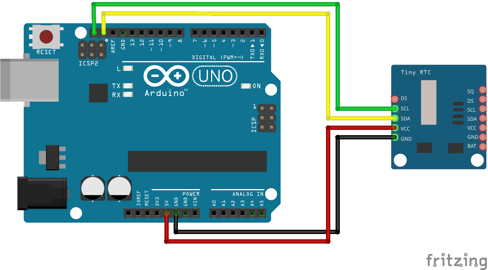

# Código do curso Magos do Arduino para utilizar um sensor RTC (horas em tempo real) DS1307 com o Arduino

### Imprima no monitor serial a data e hora atual no formato "Sábado, 20 de Setembro de 2025, 9:06:39" com o Arduino.

### Dependências
Utiliza a biblioteca uRTCLib por Naguissa, que pode ser instalada através do gerenciador de bibliotecas do Arduino IDE.

### Artigo do projeto
[https://magosdoarduino.web.app/sensor-rtc-ds1307-arduino.html](https://magosdoarduino.web.app/sensor-rtc-ds1307-arduino.html)

### Componentes necessários
* 1x Breadboard (opcional)
* 1x Placa Arduino
* 1x Sensor RTC DS1307
* 1x Bateria CR2032
* Jumpers

### Circuito

