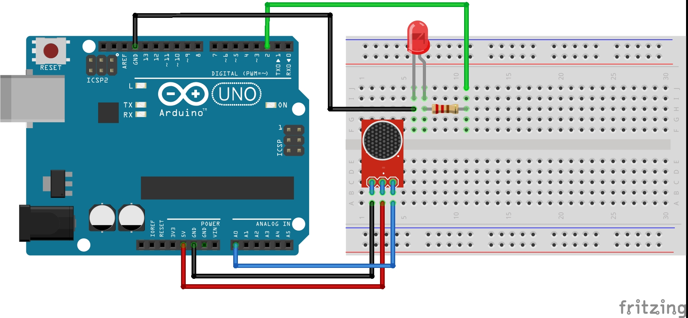

# Código do curso Magos do Arduino para utilizar um sensor de batida com o Arduino

### Utilize o sensor de batida para acender e apagar um LED quando o sensor detectar um sinal maior do que o limite definido no código do Arduino

### Artigo do projeto
[https://magosdoarduino.web.app/sensor-batida-knock-hall-arduino.html](https://magosdoarduino.web.app/sensor-batida-knock-hall-arduino.html)

### Componentes necessários
* 1x Breadboard
* 1x Placa Arduino
* 1x LED
* 1x Resistor de 220-330 Ohms
* 1x Sensor de batida (Knock)
* Jumpers

### Circuito

