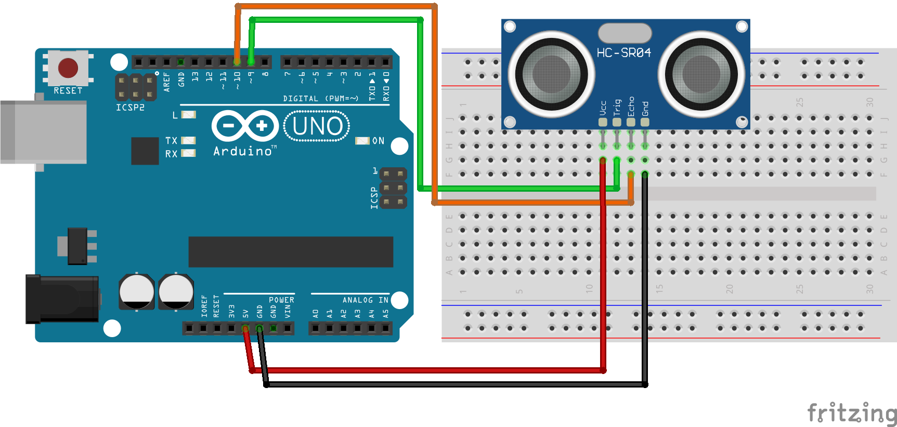
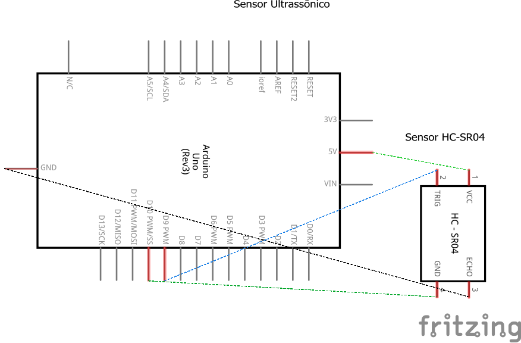

# Código para conectar um sensor de distância ultrassônico HC-SR04 no Arduino

### Neste projeto um sensor de distância ultrassônico HC-SR04 será conectado ao Arduino, e a distância medida em centímetros (cm) de um objeto será impresso no monitor serial do Arduino IDE.

### Artigo do projeto
[https://magosdoarduino.web.app/sensor-distancia-ultrassonico-hcsr04-arduino.html](https://magosdoarduino.web.app/sensor-distancia-ultrassonico-hcsr04-arduino.html)

### Componentes necessários
* 1x Placa Arduino
* 1x Breadboard (opcional)
* 1x Sensor de distância ultrassônico HC-SR04
* Jumpers

### Circuito

### Schematics

