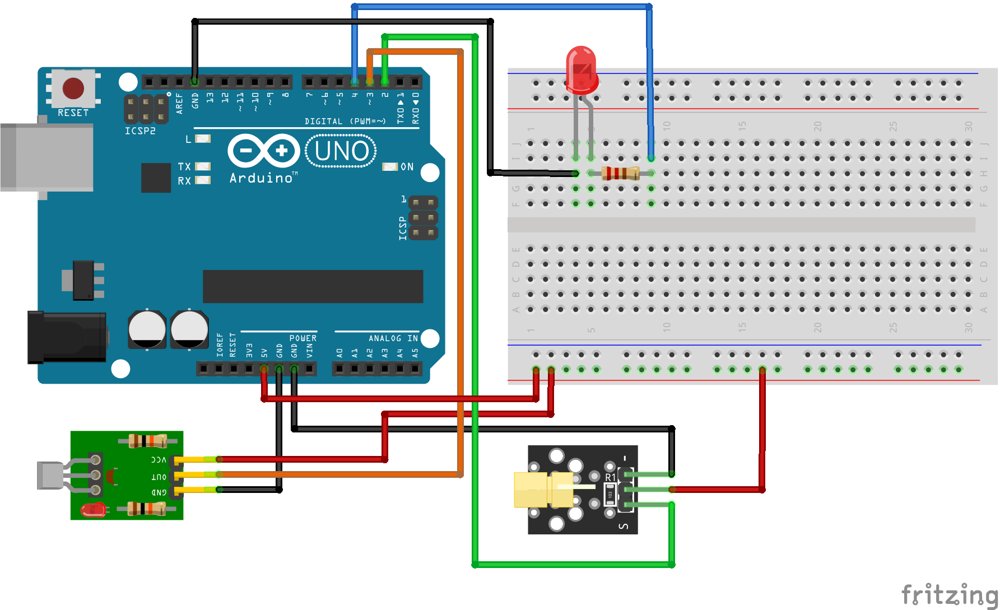

# Código do curso Magos do Arduino para utilizar um sensor de laser com o Arduino

### Utilize o sensor de laser para acender e apagar um LED quando o feixe de laser estiver interrompido pelo obstáculo

### Artigo do projeto
[https://magosdoarduino.web.app/sensor-laser-arduino.html](https://magosdoarduino.web.app/sensor-laser-arduino.html)

### Componentes necessários
* 1x Breadboard
* 1x Placa Arduino
* 1x LED
* 1x Resistor de 220-330 Ohms
* 1x Sensor emissor de laser
* 1x Sensor receptor luz (Fotodiodo / Fototransistor)
* Jumpers

### Circuito

