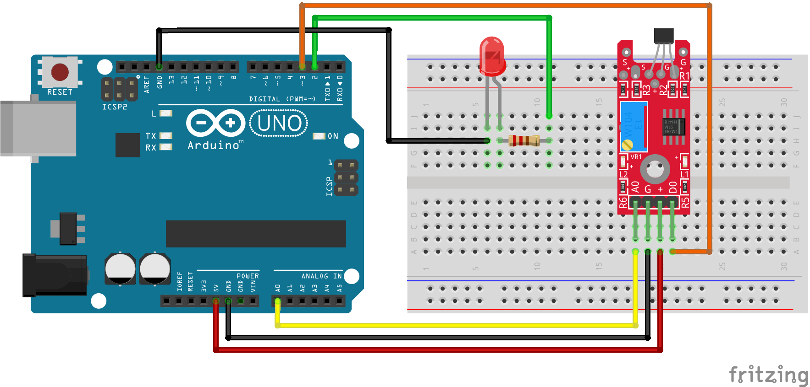

# Código do curso Magos do Arduino para utilizar um sensor magnético com o Arduino

### Utilize o sensor magnético para acender e apagar um LED quando um ímã for aproximado no sensor. As leituras digital e analógica do sensor são impressas no monitor serial

### Artigo do projeto
[https://magosdoarduino.web.app/sensor-magnetico-arduino.html](https://magosdoarduino.web.app/sensor-magnetico-arduino.html)

### Componentes necessários
* 1x Breadboard
* 1x Placa Arduino
* 1x LED
* 1x Resistor de 220-330 Ohms
* 1x Sensor magnético
* Jumpers

### Circuito

