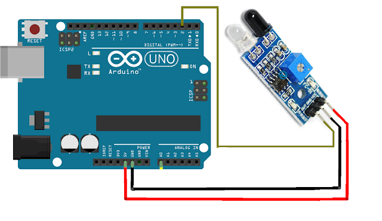

# Código para conectar um sensor de obstáculo infravermelho no Arduino

### Neste projeto um sensor de obstáculo infravermelho será conectado ao Arduino, e o número de detecções será impressa no monitor serial do Arduino IDE.

### Artigo do projeto
[https://magosdoarduino.web.app/sensor-obstaculo-infravermelho-arduino.html](https://magosdoarduino.web.app/sensor-obstaculo-infravermelho-arduino.html)

### Componentes necessários
* 1x Placa Arduino
* 1x Breadboard (opcional)
* 1x Sensor de obstáculo infravermelho
* Jumpers

### Circuito

