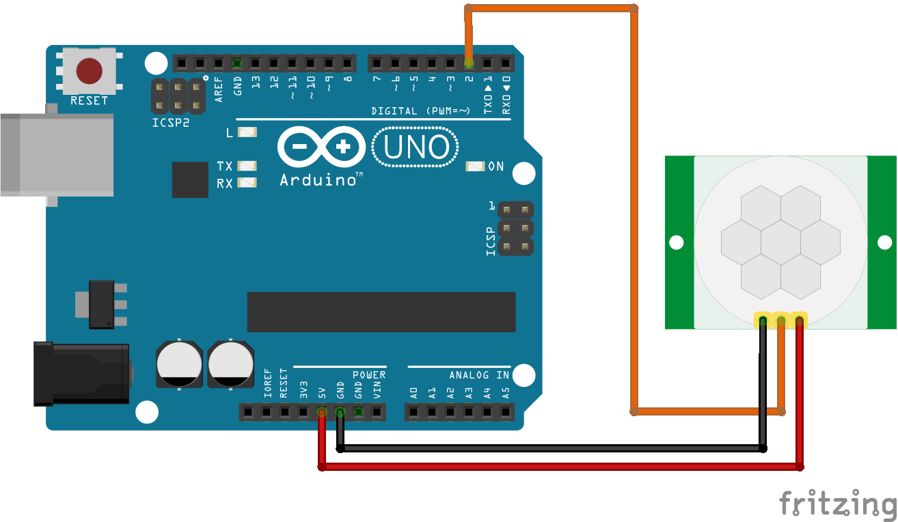
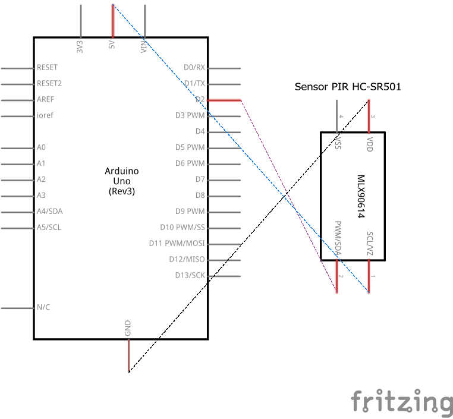

# Código para conectar um sensor de presença PIR SR501 no Arduino

### Neste projeto um sensor de presença PIR SR501 será conectado ao Arduino, e uma mensagem será impressa no Monitor Serial do Arduino IDE sempre que um movimento for detectado.

### Artigo do projeto
[https://magosdoarduino.web.app/sensor-presenca-hcsr501-arduino.html](https://magosdoarduino.web.app/sensor-presenca-hcsr501-arduino.html)

### Componentes necessários
* 1x Placa Arduino
* 1x Breadboard (opcional)
* 1x Sensor de presença PIR SR501
* Jumpers

### Circuito

### Schematics

