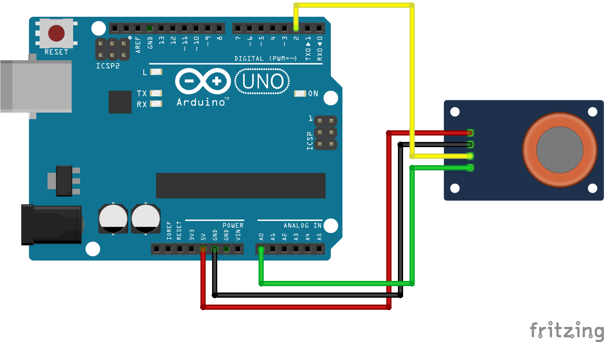

# Código do curso Magos do Arduino para utilizar um sensor de detecção de gases com o Arduino

### Imprima no monitor serial as leituras digitais e analógicas de um sensor de detecção de gases com o Arduino.

### Artigo do projeto
[https://magosdoarduino.web.app/sensor-deteccao-gas-arduino.html](https://magosdoarduino.web.app/sensor-deteccao-gas-arduino.html)

### Componentes necessários
* 1x Breadboard (opcional)
* 1x Placa Arduino
* 1x Sensor de detecção de gases
* Jumpers

### Circuito

