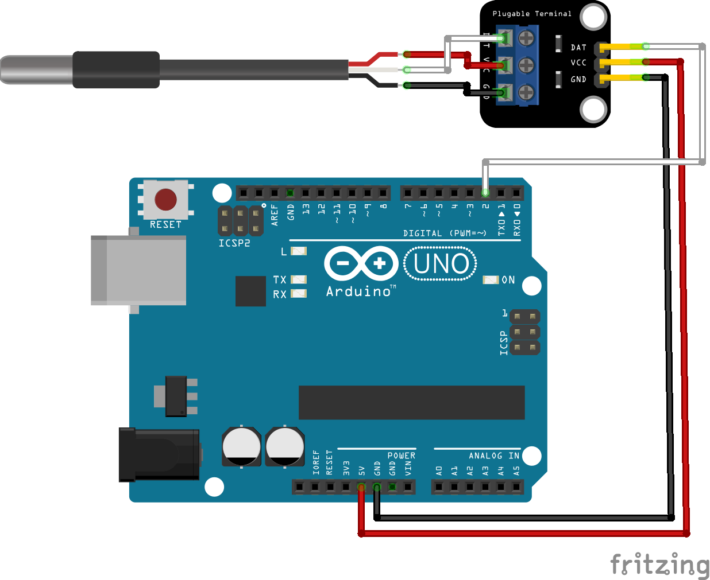

# Código do curso Magos do Arduino para utilizar um sensor de temperatura DS18B20 com o Arduino

### Imprima no monitor serial a leitura das temperaturas em graus Celcius e Fahrenheit de um sensor de temperatura DS18B20 com o Arduino

## Este código depende da instalação de duas bibliotecas, a OneWire e a Dallas Temperature.
## Ambas podem ser instaladas diretamente pelo gerenciador de bibliotecas do Arduino IDE.

### Artigo do projeto
[https://magosdoarduino.web.app/sensor-temperatura-ds18b20-arduino.html](https://magosdoarduino.web.app/sensor-temperatura-ds18b20-arduino.html)

### Componentes necessários
* 1x Breadboard (opcional)
* 1x Placa Arduino
* 1x Sensor de temperatura DS18B20
* Jumpers

### Circuito

