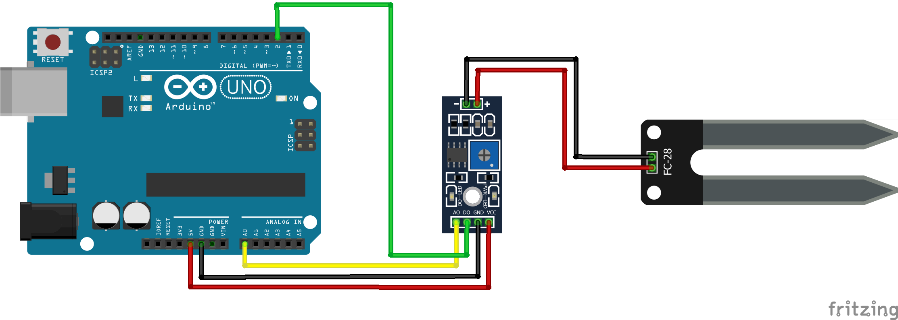

# Código do curso Magos do Arduino para utilizar um sensor de umidade de solo com o Arduino

### Imprima no monitor serial as leituras digitais e analógicas de um sensor de umidade de solo com o Arduino.

### Artigo do projeto
[https://magosdoarduino.web.app/sensor-umidade-solo-arduino.html](https://magosdoarduino.web.app/sensor-umidade-solo-arduino.html)

### Componentes necessários
* 1x Breadboard (opcional)
* 1x Placa Arduino
* 1x Sensor de umidade do solo
* Jumpers

### Circuito

