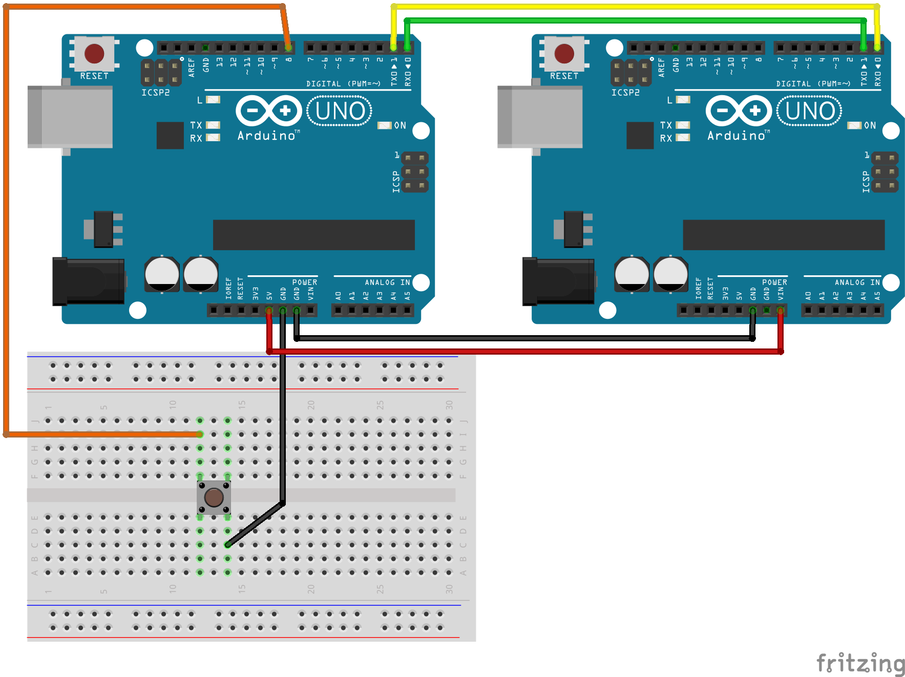
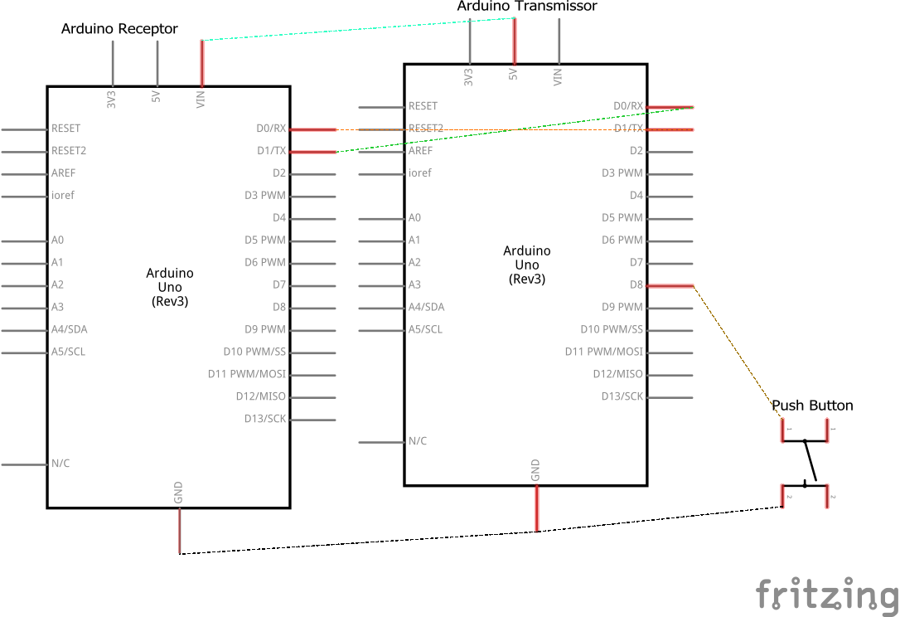

# Código para comunicar dois Arduinos usando conexão serial (UART)

### Neste projeto comunicaremos dois Arduinos usando conexão serial (UART).

### Artigo do projeto
[https://magosdoarduino.web.app/comunicacao-serial.html](https://magosdoarduino.web.app/comunicacao-serial.html)

O Arduino com o papel de transmissor terá um push button conectado a ele, e quando pressionado ele enviará um comando para o Arduino receptor que mudará o status do LED contido na placa.

Para este projeto, faça o upload dos códigos contidos nos diretórios receptor e transmissior um em cada placa Arduino, sendo o transmissor o que contém o push button conectado a ele, conforme circuito abaixo.

### Componentes necessários
* 2x Placas Arduino
* 1x Breadboard
* 1x Push Button
* Jumpers

### Circuito

### Schematics
