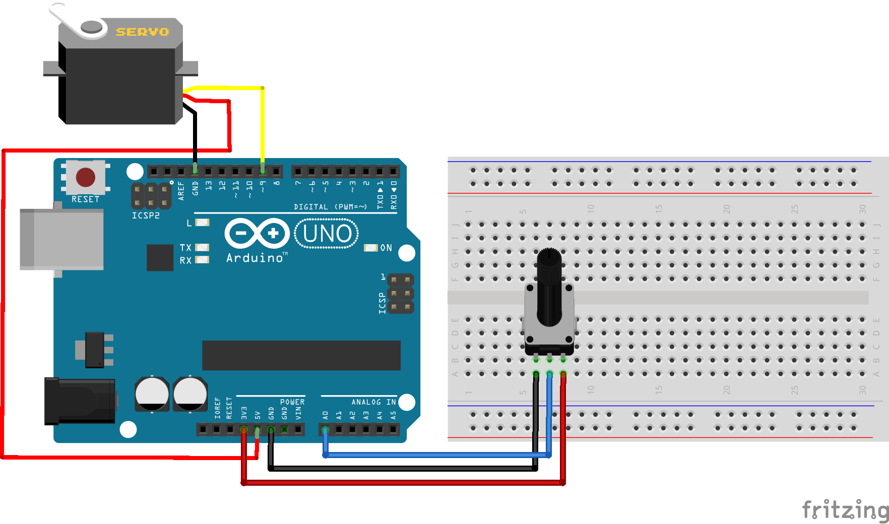

# Código para controlar um servo motor com o Arduino

###  Neste projeto controlaremos um servo motor com o Arduino. Um potenciômetro será utilizado no circuito para mover o servo motor no intervalo de 0 a 180 graus.

### Artigo do projeto
[https://magosdoarduino.web.app/servo-motor-arduino.html](https://magosdoarduino.web.app/servo-motor-arduino.html)

### Componentes necessários
* 1x Placa Arduino
* 1x Breadboard
* 1x Servo Motor
* 1x Potenciômetro de 10k
* Jumpers

### Circuito

