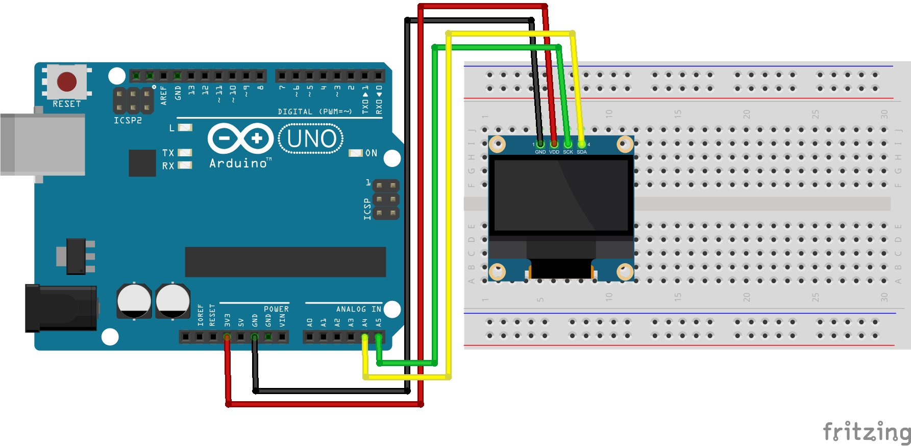

# Código do curso Magos do Arduino para controlar um display SSD1306 I2C com o Arduino

### Este código demonstra como conectar um display SSD1306 I2C com o Arduino, utilizando a biblioteca da Adafruit para exibir no display formas geométricas, texto, bitmaps e também scroll de tela.

Este código faz o uso de duas bibliotecas da Adafruit, a **Adafruit_SSD1306** e a **Adafruit_GFX**, que podem ser instaladas diretamente pelo gerenciador de bibliotecas do Arduino IDE.

Como este display utiliza conexão I2C, utilize os seguintes pinos do Arduino:
* Arduino UNO: A4(SDA), A5(SCL)
* Arduino MEGA 2560: 20(SDA), 21(SCL)
* Arduino LEONARDO: 2(SDA), 3(SCL)

Ao utilizar fontes no padrão 437, verifique em https://en.wikipedia.org/wiki/Code_page_437 os códigos disponíveis para cada caracter disponível.

Esta biblioteca permite exibir imagens binárias no display, mas para isso precisamos dela no formato binário, como:

```
static const unsigned char PROGMEM gato16x16[] = {
	0x10, 0x22, 0x08, 0x36, 0x30, 0x3e, 0x40, 
    0x2a, 0x80, 0x6a, 0x80, 0x78, 0xc0, 0x38, 
    0x60, 0xd8, 0x1f, 0xe0, 0x1f, 0xf0, 0x1f, 
    0xf8, 0x3f, 0xe0, 0x30, 0x60, 0x68, 0x6c, 
    0x48, 0xc4, 0x44, 0x84
};
```

Portanto, caso deseje criar os seus próprios códigos binários para representar imagens (bitmap), utilize https://javl.github.io/image2cpp para facilitar a criação dos binários da imagem.

### Artigo do projeto
[https://magosdoarduino.web.app/ssd1306-i2c-arduino.html](https://magosdoarduino.web.app/ssd1306-i2c-arduino.html)

### Componentes necessários
* 1x Breadboard (opcional)
* 1x Placa Arduino UNO
* 1x Display SSD1306 I2C de 0.96 polegadas (128x64 pixels)
* Jumpers

### Circuito
