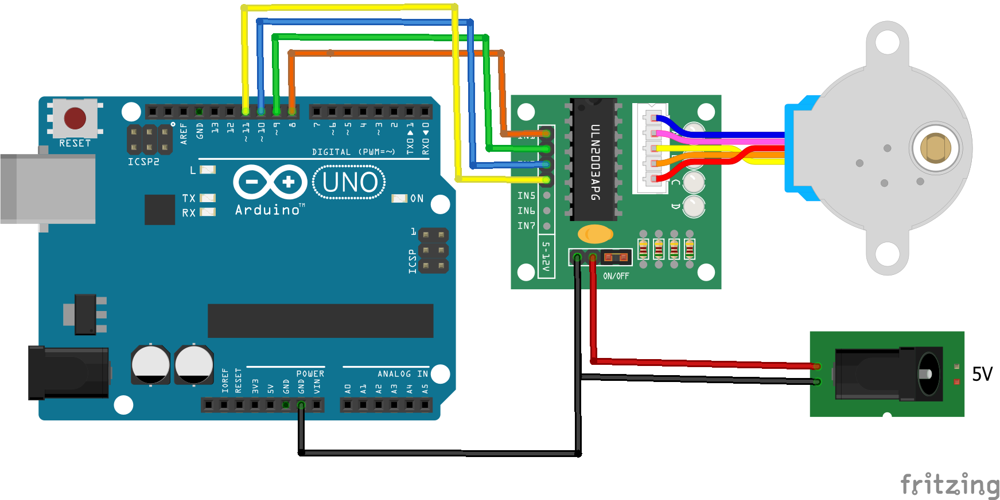
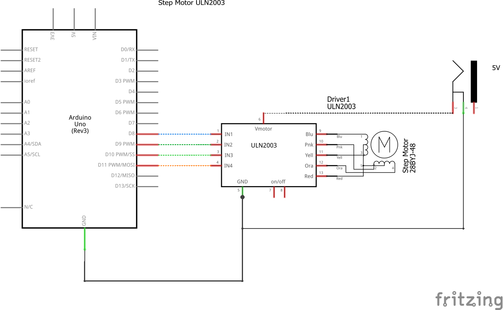

# Código para controlar um step motor com o módulo ULN2003 no Arduino

###  Controle de um step motor usando o módulo ULN2003 com o Arduino. Este código demonstra como rotacionar o motor em diferentes direções e velocidades.

### Artigo do projeto
[https://magosdoarduino.web.app/step-motor-uln2003-arduino.html](https://magosdoarduino.web.app/step-motor-uln2003-arduino.html)

### Componentes necessários
* 1x Placa Arduino
* 1x Breadboard
* 1x Step Motor
* 1x Módulo ULN2003
* 1x Alimentação externa de 5v
* Jumpers

### Circuito

### Schematics

