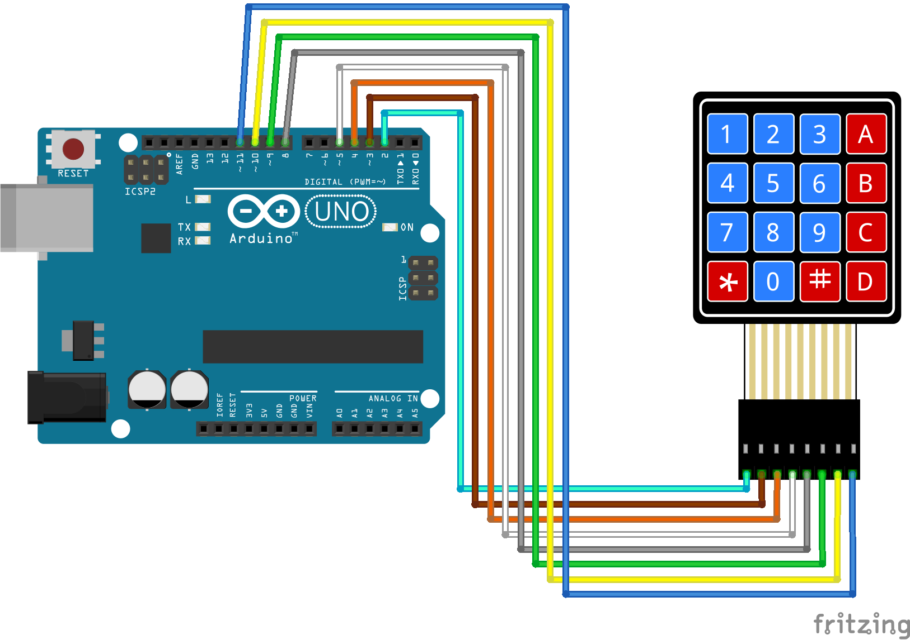

# Código do curso Magos do Arduino para utilizar um teclado numérico matriz de 4x4 com o Arduino

### Imprima no monitor serial as leituras dos valores de cada tecla pressionada no teclado numérico matriz de 4x4 com o Arduino.

### Dependências
Para controlar o teclado numérico, precisaremos da biblioteca *Adafruit keypad*  [https://learn.adafruit.com/matrix-keypad/arduino](https://learn.adafruit.com/matrix-keypad/arduino), que pode ser instalada diretamente através do Arduino IDE.

Esta biblioteca consegue controlar diferentes tipos de teclados matriz, como 4x3 por exemplo. Leia a documentação oficial do projeto para maiores detalhes.

### Artigo do projeto
[https://magosdoarduino.web.app/teclado-matriz-4x4-arduino.html](https://magosdoarduino.web.app/teclado-matriz-4x4-arduino.html)

### Componentes necessários
* 1x Breadboard (opcional)
* 1x Placa Arduino
* 1x Teclado numérico matriz de 4x4
* Jumpers

### Circuito

