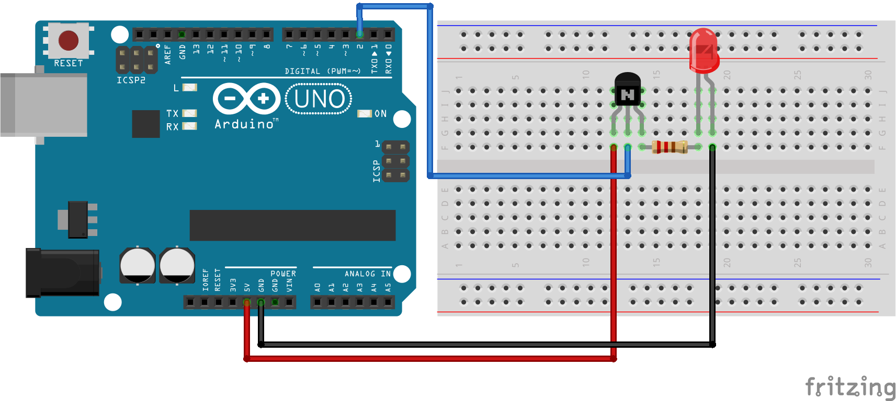
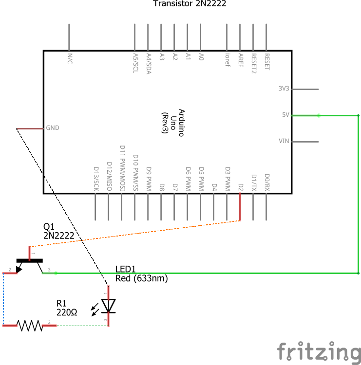

# Código para utilizar um transistor com o Arduino

### Neste projeto um transistor 2N2222 é utilizado em conjunto com o Arduino para controlar um LED, fazendo o mesmo piscar em um intervalo de meio segundo.

### Artigo do projeto
[https://magosdoarduino.web.app/transistor-2n2222-led-arduino.html](https://magosdoarduino.web.app/transistor-2n2222-led-arduino.html)

### Componentes necessários
* 1x Placa Arduino
* 1x Breadboard
* 1x Transistor 2N2222 ou similar
* 1x LED
* 1x Resistor de 220-330 Ohms
* Jumpers

### Circuito

### Schematics

